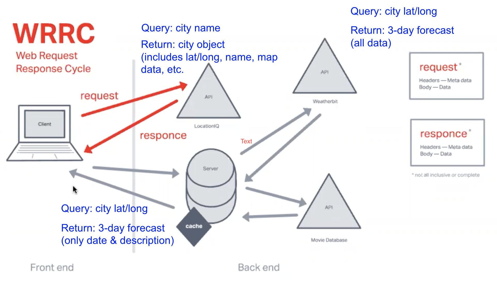

# City Explorer API

**Author**: Jason Christopher  
**Version**: 3.0.2

## Overview

This app allows the user to input a city name and the LocationIQ API will select find a best match. That best match city will be displayed in a card with a static Google map image of the city. The user may then click on the "Get Weather" button to display a modal with a carousel that shows three days-worth of weather. Below the main city card are up to six more cards with matching movies that include the name of the input city. These cards include the movie title, release year, and a short overview.

## Getting Started

The user only needs to type a city name in the input field and click the "Explore!" button to display the resulting city map. Then the user may click the "Get Weather" in the corresponding card to display a modal of the weather data for 3 days. Movies that include the input city's name are also displayed below the main city card with some basic movie information.

## Architecture

The client inputs the name of the desired city. Then the app passes that query as a string to the locationIQ API that returns 10 matches. Only the best match is used and the latitude and longitude is passed again to the LocationIQ API to produce the static image of the city map and the city name is used in the card header. The app passes the city's latitude and longitude to the server which contacts the WeatherBit API and returns three days of weather information in an array. That weather is then passed to the Forecast.js file where it is extracted and displayed in a modal/carousel. The app also passes the input city name to the server which contacts The Movie DB API and returns movies that have the input city's name in the title. The server extracts the top 6 matches and passes that information in an array to the app to display in cards.

### Lab 7

### Lab 8

## Change Log

* 11-14-2022 7:21pm - Application now successfully calls the LocationIQ API to display the matching city name and map.  
* 11-15-2022 10:34pm - Application now successfully communicates with the server API to display the matching city's weather data.  
* 11-16-2022 4:44pm - Server now successfully communicates with the WeatherBit and Movie DB APIs to provide live data to the app. Movie information is now displayed.

## Time Estimation

### Name of feature: Asynchronous code, and APIs

* Estimate of time needed to complete: 3 hours
* Start time: 3pm
* Finish time: 7pm
* Actual time needed to complete: 4 hours

### Name of feature: Custom Servers with Node and Express

* Estimate of time needed to complete: 3 hours
* Start time: 4pm
* Finish time: 8pm
* Actual time needed to complete: 4 hours

### Name of feature: Live Weather and Movie Data

* Estimate of time needed to complete: 3 hours
* Start time: 2pm
* Finish time: 4pm
* Actual time needed to complete: 2 hours
